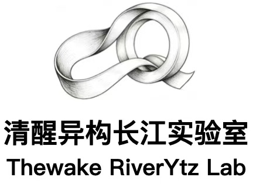
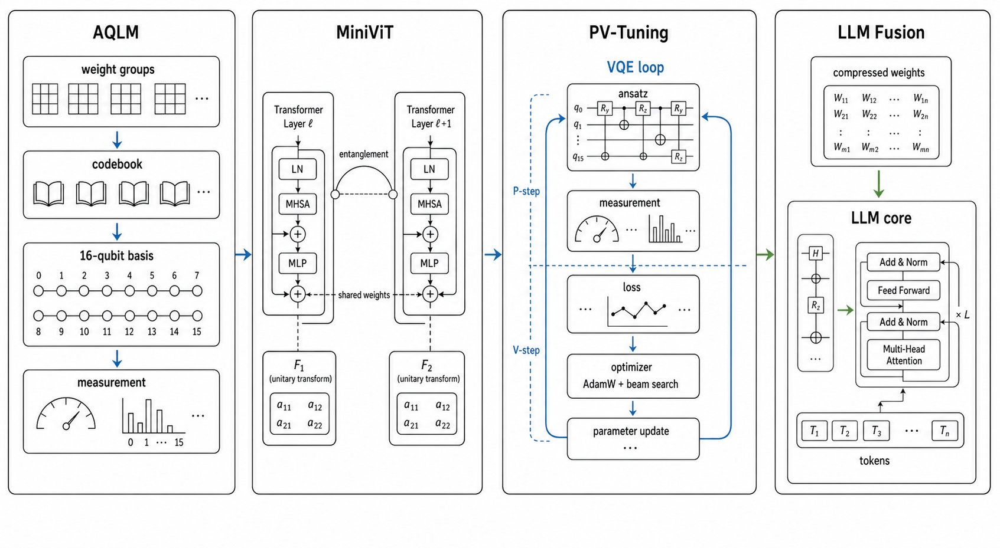

<p align="center">
  
</p>

<p align="center">
  <strong>Simulated Quantum Computing for VLM Compression</strong><br>
  Quantum-inspired discretization · Entanglement-driven multiplexing · Variational recovery
</p>

<p align="center">
  <a href="#-quick-start"></a>
  <a href="docs/quantize.md"></a>
  <a href="docs/compress.md"></a>
  <a href="docs/finetune.md"></a>
  <a href="docs/PV_TUNING_TECHNICAL_DOC.md"></a>
  <a href="https://riverone.vip.cpolar.cn"></a>
</p>

<p align="center">
  
  
  
  
</p>

---

## 📊 Pipeline Overview

<p align="center">
  
</p>

**RiverONE** treats VLM compression as a **simulated quantum computing problem**. A 4B-parameter multimodal model (8.9 GB) is compressed to 3.2 GB (2.8×) through three quantum-inspired stages — without running on quantum hardware. Each stage maps to a core quantum computing primitive: **state discretization**, **entanglement sharing**, and **variational optimization**. Additionally, VQC ParamGen explores quantum circuit-based **weight synthesis** for neural network parameters.

---

## ⚛️ Quantum-Inspired Architecture

### Stage 1 — AQLM: Quantum State Discretization

> *"Every weight lives in a 16-qubit Hilbert space."*

Classical neural network weights exist in a continuous vector space ℝᵈ. AQLM **discretizes** this space into a finite quantum state basis, analogous to how a quantum system collapses into one of 2ⁿ measurement outcomes.

| Quantum Concept | AQLM Implementation |
|:---|:---|
| **Qubit register** (16 qubits) | Codebook of size 2¹⁶ = 65,536 basis vectors |
| **State vector** | Each weight group of 16 values encoded as one codebook index |
| **Measurement** | Nearest-neighbor lookup: each group collapses to the closest codebook entry |
| **Superposition** | Additive quantization reconstructs weights as linear combinations of basis states |
| **State space** | 252 matrices × thousands of groups = millions of "quantum measurements" |

The **1×16 scheme** (out_group_size=1, in_group_size=16) means each group of 16 weights is represented by a single 16-bit index — exactly one measurement outcome from a 16-qubit system. The LLM's 7.9 GB of linear projections compress to 0.98 GB, an **8× reduction** — the same ratio as classical bits to qubits in certain encodings.

**Key insight**: The codebook is a *learned quantum basis*. K-Means initialization finds the natural clustering of weight patterns (the "energy eigenstates"), and Adam optimization refines them — exactly analogous to finding the optimal measurement basis for a quantum system.

---

### Stage 2 — MiniViT: Entanglement-Driven Multiplexing

> *"Two layers, one state — entanglement without the hardware."*

In quantum mechanics, **entangled particles share a single quantum state** regardless of distance. MiniViT applies this principle to vision transformers: adjacent blocks (23 and 24) are forced to **share the same weight state**, creating an entanglement-like coupling.

| Quantum Concept | MiniViT Implementation |
|:---|:---|
| **Entanglement** | Blocks 23 and 24 share MSA + MLP weights (one state, two observers) |
| **Unitary transform** | F1, F2 (16×16 matrices) act as learned unitary rotations between the shared state and each block |
| **Weak measurement** | Depthwise convolution (dwconv) applies a minimal perturbation to break symmetry |
| **Decoherence protection** | LayerNorm and TransformNorm preserve independent phase information per block |

The result: **~14M parameters replaced by ~12K** — a compression ratio of >1000× for the coupled blocks. The transform matrices (F1, F2) function as **unitary gates** rotating the shared representation into each block's local "measurement basis." Distillation from the original ViT acts as a **quantum state tomography** — reconstructing the optimal transform from the teacher's output distribution.

**Key insight**: This is entanglement *simulation* — two computational paths share one weight state, with minimal unitary corrections preserving their distinct behaviors. No quantum hardware required.

---

### Stage 3 — PV-Tuning: Variational Quantum-Classical Optimization

> *"The VQE loop, but for neural network weights."*

PV-Tuning mirrors the **Variational Quantum Eigensolver (VQE)** — the most successful hybrid quantum-classical algorithm. VQE alternates between a quantum measurement step and a classical parameter update. PV-Tuning does the same for compressed model weights.

| Quantum Concept | PV-Tuning Implementation |
|:---|:---|
| **Variational ansatz** | Codebooks + scales = the parameterized quantum circuit |
| **Expectation value** | Cross-entropy loss on QcalEval SFT (2,166 samples) |
| **P-step** (classical optimizer) | AdamW updates continuous codebooks/scales — like updating rotation angles in a variational circuit |
| **V-step** (quantum measurement) | Top-τ subspace beam search updates discrete codes — like measuring qubits in the computational basis |
| **Pauli grouping** | Subspace selection: only the top-τ highest-gradient code groups are updated per step |
| **Convergence guarantee** | Theorem 3.1: φ(xₖ₊₁) ≤ φ(xₖ) — monotonic improvement, same as the variational principle |

The **subspace trick** is the quantum magic: instead of updating all 1.5M+ code assignments simultaneously (exponentially expensive, like full state tomography), PV-Tuning selects only the top-τ most "uncertain" groups (~0.1% per step). This is equivalent to measuring only the qubits with the largest gradient — a **partial measurement** that avoids disturbing the converged subspace.

**Key insight**: The P/V loop provably converges because each step is a projection onto a smaller feasible set — exactly the same mathematical structure as the quantum variational principle, where each measurement collapses the state toward the ground energy.

---

### Stage 4 — VQC ParamGen: Quantum Circuit Parameter Generation

> *"Neural network weights as quantum measurement outcomes."*

VQC ParamGen inverts the compression paradigm: instead of compressing existing weights, it **generates** MLP weight matrices directly from a Variational Quantum Circuit (VQC). Random classical features are amplitude-encoded into a quantum state, processed through variational layers with ring entanglement, then measured — and the measurement outcomes drive a HyperNetwork that synthesizes the target weight matrix via low-rank factorization.

| Quantum Concept | VQC ParamGen Implementation |
|:---|:---|
| **Amplitude encoding** | Random features mapped to 2ⁿ-wires quantum state amplitudes |
| **Variational ansatz** | RX, RY, RZ rotation gates + CNOT ring entanglement across layers |
| **Depolarizing noise** | Probabilistic X/Y/Z gate injection simulates NISQ-era hardware |
| **PauliZ measurement** | Expectation values form a classical feature vector for the HyperNetwork |
| **Quantum-classical bridge** | HyperNetwork (MLP) maps n-wire measurements → low-rank factors U, V |
| **Matrix reconstruction** | W = U @ V^T, with rank r ≪ min(out_dim, in_dim) avoiding ~5M direct outputs |

The low-rank decomposition is the key enabler: a weight matrix of shape [4304, 1152] (~5M parameters) is generated from only r × (out_dim + in_dim) HyperNetwork outputs. With rank=64, this reduces the generation head to ~350K parameters — a >14× compression of the generation pathway itself.

**Key insight**: This is quantum-classical **parameter synthesis** — the VQC acts as a structured random projection with trainable unitary rotations, and the HyperNetwork learns to map these quantum features to the weight manifold. Unlike post-hoc compression, this approach *generates* weights that are born in a quantum-informed subspace.

---

## 🔬 Why Quantum-Inspired?

Traditional compression pipelines view quantization as an *engineering tradeoff* — sacrifice precision for size. The quantum perspective reveals a deeper structure:

| Classical View | Quantum View |
|:---|:---|
| Weights are real numbers | Weights are quantum states in a discrete Hilbert space |
| Quantization is approximation error | Quantization is measurement in a learned basis |
| Weight sharing is parameter reuse | Weight sharing is entanglement between layers |
| Fine-tuning is gradient descent | Fine-tuning is variational optimization with discrete measurements |
| Quality loss is inevitable | Quality is recoverable through the variational principle |

This perspective isn't just philosophical — it **predicts** that PV-Tuning should converge (Theorem 3.1), that 1×16 is the natural "qubit encoding" for this architecture, and that entanglement-style sharing should preserve information better than independent compression.

---

## 🚀 Quick Start

### Installation

```bash
git clone https://github.com/THeWakeSystems/RiverONE.git
cd RiverONE
pip install -r requirements.txt
```

### Stage 1 — AQLM State Discretization

Discretize all 36 LLM layers into the 16-qubit codebook space:

```bash
cd quantize
pip install -r requirements.txt
python quantize.py          # ~2-3.5 hours on A100
```

> 📖 [Full quantization guide →](docs/quantize.md)

### Stage 2 — MiniViT Entanglement

Entangle adjacent vision transformer blocks via weight multiplexing:

```bash
cd compress
python apply_minivit.py     # Entangle blocks 23→24
python distill_minivit.py   # State tomography (distillation)
python verify_minivit.py    # Verify entanglement integrity
```

> 📖 [Full compression guide →](docs/compress.md)

### Stage 3 — PV-Tuning Variational Recovery

Run the VQE-like P/V loop for accuracy recovery:

```bash
cd finetune
pip install -r requirements.txt
bash run_pv_tuning.sh
```

> 📖 [PV-Tuning guide →](docs/finetune.md) | [Technical paper →](docs/PV_TUNING_TECHNICAL_DOC.md)

### Stage 4 — VQC Weight Generation

Run the VQC-based MLP weight parameter generation demo:

```bash
cd paramgen
pip install -r requirements.txt
python run_demo.py
```

> 📖 Model definitions in `paramgen/models.py` | Utilities in `paramgen/utils.py`

---

## 📁 Directory Structure

```
RiverONE/
├── engine/           AQLM quantization core (quantum state engine)
│   └── src/          aq, kmeans, beam_search, modelutils, ...
├── quantize/         State discretization configs (25 scripts)
├── compress/         Entanglement multiplexing: apply, distill, verify
├── finetune/         Variational recovery: P/V optimization loop
├── paramgen/         VQC parameter generation: models, utils, demo
├── tools/            Utilities: dequantize, analyze, swap, eval runs
├── docs/             Full documentation + technical paper
├── weights/          Model weight outputs (gitignored)
├── logs/             Archived run summaries
└── requirements.txt  Consolidated Python dependencies
```

---

## 📋 Requirements

| Component | Version |
|-----------|---------|
| Python | 3.10+ |
| PyTorch | ≥2.1.0 (CUDA 12.1+) |
| Transformers | ≥4.38.0 |
| AQLM (PyPI) | ≥1.1.0 |
| GPU | NVIDIA ≥24 GB VRAM (A100 recommended) |
| OS | Linux (Ubuntu 20.04/22.04 tested) |

---

## 📖 References

| Paper | Venue | Link |
|-------|-------|------|
| AQLM: Extreme Compression of LLMs via Additive Quantization | ICML 2024 | [arXiv 2401.06118](https://arxiv.org/abs/2401.06118) |
| MiniViT: Compressing Vision Transformers with Weight Multiplexing | CVPR 2022 | [arXiv 2204.07154](https://arxiv.org/abs/2204.07154) |
| PV-Tuning: Beyond Straight-Through Estimation | NeurIPS 2024 | [arXiv 2405.14852](https://arxiv.org/abs/2405.14852) |
| WAIC Workshop — RiverONE: Quantum-Inspired VLM Compression | WAIC 2026 | [PDF](docs/waic_workshop.pdf) |

---

<p align="center">
  <sub>RiverONE-QC-4B-v1 · InternVL3.5-4B + Ising Vision Encoder · Built at THeWake Systems</sub>
</p>
