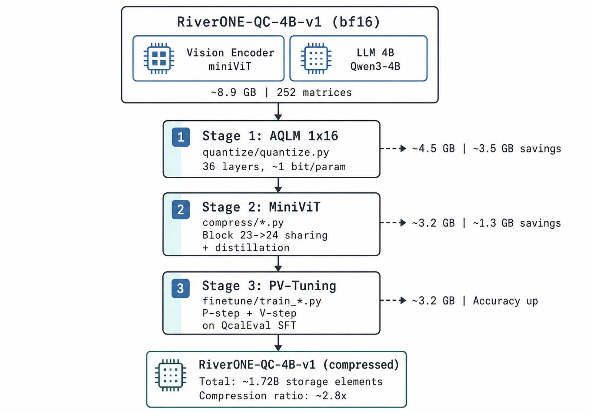

<p align="center">
  
</p>

<p align="center">
  <strong>Extreme LLM Compression Pipeline</strong><br>
  AQLM Quantization → MiniViT Vision Compression → PV-Tuning Recovery
</p>

<p align="center">
  <a href="#-quick-start"></a>
  <a href="docs/quantize.md"></a>
  <a href="docs/compress.md"></a>
  <a href="docs/finetune.md"></a>
  <a href="docs/PV_TUNING_TECHNICAL_DOC.md"></a>
</p>

<p align="center">
  
  
  
  
</p>

---

## 📊 Pipeline Overview

<p align="center">
  
</p>

Three-stage compression: **AQLM quantization** (252 matrices → ~1 bit/param) → **MiniViT** (vision weight multiplexing) → **PV-Tuning** (P/V optimization for accuracy recovery). Total compression: **8.9 GB → 3.2 GB (2.8×)**.

## ✨ Key Features

<table>
<tr><td width="50%">

### 🗜️ AQLM Quantization
- **1×16 scheme** — 1 codebook, in_group_size=16, out_group_size=1
- **Codebook size**: 65,536 (16-bit codes)
- **Effective bit-width**: ~1 bit/param
- **Scope**: All 36 LLM decoder layers × 7 projections = **252 quantized matrices**
- LLM storage: 7.9 GB → 0.98 GB (8× compression)

</td><td width="50%">

### 🎯 Selective Preservation
Preserved at **BF16 precision**:
- Vision encoder (miniViT)
- mlp1 multimodal projector
- Embeddings + LM Head
- All normalization layers
- Attention Q/K norm

</td></tr>
<tr><td width="50%">

### 🔄 MiniViT Compression
- **Weight multiplexing** between adjacent ViT blocks (23→24)
- Lightweight transform: F1, F2 (16×16), dwconv
- **~12K new params** replace ~14M shared weights
- Distillation with original ViT as teacher

</td><td width="50%">

### 🎯 PV-Tuning Recovery
- **P step**: Fix codes, optimize codebooks/scales via backprop
- **V step**: Fix codebooks, update codes via top-τ subspace beam search
- **Convergence guarantee** (Theorem 3.1): monotonic loss decrease
- Fine-tuned on QcalEval SFT (2,166 samples)

</td></tr>
</table>

## 🚀 Quick Start

### Installation

```bash
git clone https://github.com/THeWakeSystems/RiverONE.git
cd RiverONE
pip install -r requirements.txt
```

### Stage 1 — AQLM Quantization

Quantize all 36 LLM layers with the 1×16 scheme:

```bash
cd quantize
pip install -r requirements.txt
python quantize.py          # ~2-3.5 hours on A100
```

> 📖 [Full quantization guide →](docs/quantize.md)

### Stage 2 — MiniViT Compression

Apply weight multiplexing + distillation to the vision encoder:

```bash
cd compress
python apply_minivit.py     # Weight sharing (block 23→24)
python distill_minivit.py   # Distillation training
python verify_minivit.py    # Verification
```

> 📖 [Full compression guide →](docs/compress.md)

### Stage 3 — PV-Tuning Recovery

Fine-tune quantized parameters for accuracy recovery:

```bash
cd finetune
pip install -r requirements.txt
bash run_pv_tuning.sh
```

> 📖 [PV-Tuning guide →](docs/finetune.md) | [Technical paper →](docs/PV_TUNING_TECHNICAL_DOC.md)

## 📁 Directory Structure

```
RiverONE/
├── engine/           AQLM quantization core library
│   └── src/          aq, kmeans, beam_search, modelutils, ...
├── quantize/         Quantization configs (25 scripts, 4L–36L variants)
├── compress/         MiniViT: apply, distill, verify
├── finetune/         PV-Tuning: train, evaluate, fix_dtypes
├── tools/            Utilities: dequantize, analyze, swap, eval runs
├── docs/             Full documentation + technical paper
├── weights/          Model weight outputs (gitignored)
├── logs/             Archived run summaries
└── requirements.txt  Consolidated Python dependencies
```

## 📋 Requirements

| Component | Version |
|-----------|---------|
| Python | 3.10+ |
| PyTorch | ≥2.1.0 (CUDA 12.1+) |
| Transformers | ≥4.38.0 |
| AQLM (PyPI) | ≥1.1.0 |
| GPU | NVIDIA ≥24 GB VRAM (A100 recommended) |
| OS | Linux (Ubuntu 20.04/22.04 tested) |

## 📖 References

| Paper | Venue | Link |
|-------|-------|------|
| AQLM: Extreme Compression of LLMs via Additive Quantization | ICML 2024 | [arXiv 2401.06118](https://arxiv.org/abs/2401.06118) |
| MiniViT: Compressing Vision Transformers with Weight Multiplexing | CVPR 2022 | [arXiv 2204.07154](https://arxiv.org/abs/2204.07154) |
| PV-Tuning: Beyond Straight-Through Estimation | NeurIPS 2024 | [arXiv 2405.14852](https://arxiv.org/abs/2405.14852) |

---

<p align="center">
  <sub>RiverONE-QC-4B-v1 · Qwen3-4B + Ising Vision Encoder · Built at THeWake Systems</sub>
</p>
