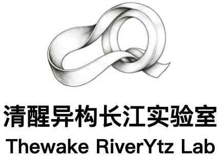
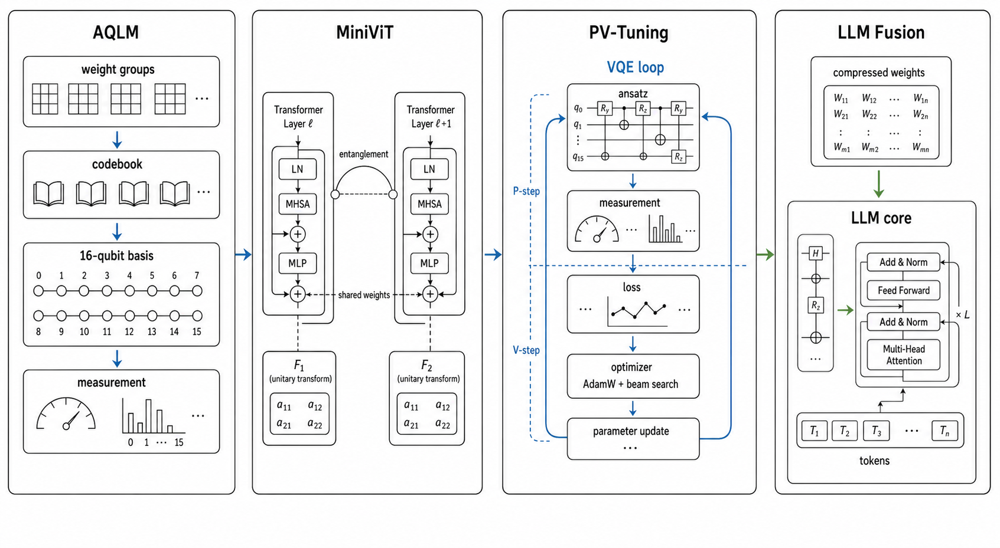

<p align="center">
  
</p>

<p align="center">
  <strong>Simulated Quantum Computing for VLM Compression</strong><br>
  Quantum-inspired discretization · Variational recovery · Entanglement-driven multiplexing
</p>

<p align="center">
  <a href="#-quick-start"></a>
  <a href="docs/quantize.md"></a>
  <a href="docs/finetune.md"></a>
  <a href="docs/compress.md"></a>
  <a href="docs/PV_TUNING_TECHNICAL_DOC.md"></a>
  <a href="https://riverone.vip.cpolar.cn"></a>
  <a href="https://arxiv.org/abs/2606.29966"></a>
  <a href="https://huggingface.co/ThewakeRiver/RiverONE"></a>
  <a href="https://www.modelscope.cn/models/ThewakeRiverYtzLab/RiverONE"></a>
</p>

<p align="center">
  
  
  
  
</p>

---

## 📊 Pipeline Overview

<p align="center">
  
</p>

**RiverONE** treats VLM compression as a **simulated quantum computing problem**. A 4B-parameter multimodal model (8.9 GB) is compressed to 1.9B parameters (excluding AQLM codebook indices) through four quantum-inspired stages — without running on quantum hardware. Each stage maps to a core quantum computing primitive: **state discretization**, **variational optimization**, **entanglement sharing**, and **parameter synthesis**.

---

## ⚛️ Quantum-Inspired Architecture

### Stage 1 — AQLM: Quantum State Discretization

> *"Every weight lives in a 16-qubit Hilbert space."*

Classical neural network weights exist in a continuous vector space ℝᵈ. AQLM **discretizes** this space into a finite quantum state basis, analogous to how a quantum system collapses into one of 2ⁿ measurement outcomes.

| Quantum Concept | AQLM Implementation |
|:---|:---|
| **Qubit register** (16 qubits) | Codebook of size 2¹⁶ = 65,536 basis vectors |
| **State vector** | Each weight group of 16 values encoded as codebook indices |
| **Measurement** | Nearest-neighbor lookup: each group collapses to the closest codebook entry |
| **Superposition** | Additive quantization: 2 codebooks combine linearly to reconstruct weights |
| **State space** | 175 matrices × millions of groups = millions of "quantum measurements" |

The **2×16 scheme** (2 codebooks, 16-bit each) targets LLM layers 8-32 (25 of 36). Each group of 16 weights is encoded by two 16-bit code indices. The LLM's linear projections compress ~8× — the same ratio as classical bits to qubits in certain encodings. Early layers (L0-L7) and late layers (L33-L35) remain at full bf16 precision to preserve semantic understanding and output quality.

**Key insight**: The codebook is a *learned quantum basis*. K-Means initialization finds the natural clustering of weight patterns (the "energy eigenstates"), and Adam optimization refines them — exactly analogous to finding the optimal measurement basis for a quantum system.

---

### Stage 2 — PV-Tuning: Variational Quantum-Classical Optimization

> *"The VQE loop, but for neural network weights."*

PV-Tuning mirrors the **Variational Quantum Eigensolver (VQE)** — the most successful hybrid quantum-classical algorithm. VQE alternates between a quantum measurement step and a classical parameter update. PV-Tuning does the same for compressed model weights.

| Quantum Concept | PV-Tuning Implementation |
|:---|:---|
| **Variational ansatz** | Codebooks + scales = the parameterized quantum circuit |
| **Expectation value** | Cross-entropy loss on QcalEval SFT (2,166 samples) |
| **P-step** (classical optimizer) | AdamW updates continuous codebooks/scales — like updating rotation angles in a variational circuit |
| **V-step** (quantum measurement) | Top-τ subspace beam search updates discrete codes — like measuring qubits in the computational basis |
| **Pauli grouping** | Subspace selection: only the top-τ highest-gradient code groups are updated per step |
| **Convergence guarantee** | Theorem 3.1: φ(xₖ₊₁) ≤ φ(xₖ) — monotonic improvement, same as the variational principle |

The **subspace trick** is the quantum magic: instead of updating all 1.5M+ code assignments simultaneously (exponentially expensive, like full state tomography), PV-Tuning selects only the top-τ most "uncertain" groups (~0.1% per step). This is equivalent to measuring only the qubits with the largest gradient — a **partial measurement** that avoids disturbing the converged subspace.

**Key insight**: The P/V loop provably converges because each step is a projection onto a smaller feasible set — exactly the same mathematical structure as the quantum variational principle, where each measurement collapses the state toward the ground energy.

---

### Stage 3 — MiniViT: Entanglement-Driven Multiplexing

> *"Two layers, one state — entanglement without the hardware."*

In quantum mechanics, **entangled particles share a single quantum state** regardless of distance. MiniViT applies this principle to vision transformers: two adjacent block pairs (23→24 and 21→22) are forced to **share the same weight state**, creating an entanglement-like coupling.

| Quantum Concept | MiniViT Implementation |
|:---|:---|
| **Entanglement** | Two pairs share MSA + MLP weights (one state, two observers each) |
| **Unitary transform** | F1, F2 (16×16 matrices) act as learned unitary rotations between the shared state and each block |
| **Weak measurement** | Depthwise convolution (dwconv) applies a minimal perturbation to break symmetry |
| **Decoherence protection** | LayerNorm and TransformNorm preserve independent phase information per block |

The result: **~28M parameters replaced by ~24K** — a compression ratio of >1000× for the coupled blocks. The transform matrices (F1, F2) function as **unitary gates** rotating the shared representation into each block's local "measurement basis." Knowledge distillation from the original ViT acts as a **quantum state tomography** — reconstructing the optimal transform from the teacher's output distribution.

**Key insight**: This is entanglement *simulation* — two computational paths share one weight state, with minimal unitary corrections preserving their distinct behaviors. No quantum hardware required.

---

### Stage 4 — VQC ParamGen: Quantum Circuit Parameter Generation

> *"Neural network weights as quantum measurement outcomes."*

VQC ParamGen inverts the compression paradigm: instead of compressing existing weights, it **generates** MLP weight matrices directly from a Variational Quantum Circuit (VQC). Random classical features are amplitude-encoded into a quantum state, processed through variational layers with ring entanglement, then measured — and the measurement outcomes drive a HyperNetwork that synthesizes the target weight matrix via low-rank factorization.

| Quantum Concept | VQC ParamGen Implementation |
|:---|:---|
| **Amplitude encoding** | Random features mapped to 2ⁿ-wires quantum state amplitudes |
| **Variational ansatz** | RX, RY, RZ rotation gates + CNOT ring entanglement across layers |
| **Depolarizing noise** | Probabilistic X/Y/Z gate injection simulates NISQ-era hardware |
| **PauliZ measurement** | Expectation values form a classical feature vector for the HyperNetwork |
| **Quantum-classical bridge** | HyperNetwork (MLP) maps n-wire measurements → low-rank factors U, V |
| **Matrix reconstruction** | W = U @ V^T, with rank r ≪ min(out_dim, in_dim) avoiding ~5M direct outputs |

The low-rank decomposition is the key enabler: a weight matrix of shape [4304, 1152] (~5M parameters) is generated from only r × (out_dim + in_dim) HyperNetwork outputs. With rank=64, this reduces the generation head to ~350K parameters — a >14× compression of the generation pathway itself.

**VQCGeneratedLinear** provides a drop-in `nn.Linear` replacement with internally learned context vectors and VQC-driven weight synthesis. This enables seamless integration into existing architectures — for example, replacing the second FFN layer in a Transformer encoder with VQC-generated weights, enabling end-to-end quantum-classical hybrid training.

**Key insight**: This is quantum-classical **parameter synthesis** — the VQC acts as a structured random projection with trainable unitary rotations, and the HyperNetwork learns to map these quantum features to the weight manifold. Unlike post-hoc compression, this approach *generates* weights that are born in a quantum-informed subspace.

---

## 🔬 Why Quantum-Inspired?

Traditional compression pipelines view quantization as an *engineering tradeoff* — sacrifice precision for size. The quantum perspective reveals a deeper structure:

| Classical View | Quantum View |
|:---|:---|
| Weights are real numbers | Weights are quantum states in a discrete Hilbert space |
| Quantization is approximation error | Quantization is measurement in a learned basis |
| Weight sharing is parameter reuse | Weight sharing is entanglement between layers |
| Fine-tuning is gradient descent | Fine-tuning is variational optimization with discrete measurements |
| Quality loss is inevitable | Quality is recoverable through the variational principle |

This perspective isn't just philosophical — it **predicts** that PV-Tuning should converge (Theorem 3.1), that 2×16 is the natural "qubit encoding" for this architecture, and that entanglement-style sharing should preserve information better than independent compression.

---

## 🚀 Quick Start

### Installation

```bash
git clone https://github.com/THeWakeSystems/RiverONE.git
cd RiverONE
pip install -r requirements.txt
```

### Stage 1 — AQLM State Discretization

Discretize LLM layers 8-32 (25 layers) into the 2×16 codebook space:

```bash
cd quantize
pip install -r requirements.txt
python quantize.py          # ~3.5 hours on A100
```

> 📖 [Full quantization guide →](docs/quantize.md)

### Stage 2 — PV-Tuning Variational Recovery

Run the VQE-like P/V loop for accuracy recovery on quantized weights:

```bash
cd finetune
pip install -r requirements.txt
bash run_pv_tuning.sh
```

> 📖 [PV-Tuning guide →](docs/finetune.md) | [Technical paper →](docs/PV_TUNING_TECHNICAL_DOC.md)

### Stage 3 — MiniViT Entanglement

Entangle adjacent vision transformer blocks via weight multiplexing (two pairs: 23→24 + 21→22):

```bash
cd compress
# Stage 3a: First pair (23→24)
python apply_minivit_23_24.py
python distill_minivit_23_24.py --epochs 10 --batch-size 4 --lr 1e-3
python verify_minivit.py --check minivit

# Stage 3b: Second pair (21→22, stacked)
python apply_minivit_21_22.py
python distill_minivit_21_22.py --epochs 10 --steps-per-epoch 50 --lr 1e-3
python verify_minivit.py --check distilled
```

> 📖 [Full compression guide →](docs/compress.md)

### Stage 4 — VQC Distillation (Required)

Compensate MiniViT shared-block accuracy loss via dual VQC weight generation.
This stage is **mandatory** — it replaces shared MLP weights (fc1, fc2) in blocks 22/24
with VQC-generated synthetic weights through a 3-phase pipeline:

```bash
cd paramgen
pip install -r requirements.txt

# Phase 1a: Train VQC to reconstruct fc1 weights (per block)
python train_vqc_fc1.py --teacher_dir ../weights/<aqlm_model>

# Phase 1b: Train VQC to reconstruct fc2 weights (per block)
python train_vqc_fc2.py --teacher_dir ../weights/<aqlm_model>

# Phase 2: Full-forward dual VQC distillation against teacher ViT
python distill_vqc_dual.py \
  --teacher_dir ../weights/<aqlm_model> \
  --student_dir ../weights/miniViT_21_24_distilled

# Phase 3: Inject VQC-generated weights into final model
python inject_vqc.py \
  --src_dir ../weights/miniViT_21_24_distilled \
  --out_dir ../weights/miniViT_21_24_distilled_vqc

# Output: weights/miniViT_21_24_distilled_vqc/
```

> 📖 Architecture: `vqc_models.py` | P1a: `train_vqc_fc1.py` | P1b: `train_vqc_fc2.py` | P2: `distill_vqc_dual.py` | P3: `inject_vqc.py`

---

## 📁 Directory Structure

```
RiverONE/
├── engine/           AQLM quantization core (quantum state engine)
│   └── src/          aq, kmeans, beam_search, modelutils, ...
├── quantize/         Stage 1 — State discretization (2×16 L8-L32)
│   ├── quantize.py   ★ Production entry point
│   ├── _framework.py AQLM engine framework
│   ├── verify.py     Post-quantization verification
│   └── ...           Analysis & utility tools
├── finetune/         Stage 2 — Variational recovery: P/V optimization loop
├── compress/         Stage 3 — Entanglement multiplexing (MiniViT ×2 pairs)
│   ├── apply_minivit_23_24.py   Pair 1: block 23→24 sharing
│   ├── distill_minivit_23_24.py Pair 1: distillation
│   ├── apply_minivit_21_22.py   Pair 2: block 21→22 sharing
│   ├── distill_minivit_21_22.py Pair 2: distillation
│   └── verify_minivit.py        Verification
├── paramgen/         Stage 4 — VQC distillation (mandatory)
│   ├── vqc_models.py      ★ VQC model definitions
│   ├── train_vqc_fc1.py   ★ Phase 1a: fc1 weight reconstruction
│   ├── train_vqc_fc2.py   ★ Phase 1b: fc2 weight reconstruction
│   ├── distill_vqc_dual.py★ Phase 2:  dual VQC distillation
│   └── inject_vqc.py      ★ Phase 3:  weight injection
├── tools/            Utilities: dequantize, decompress
├── docs/             Full documentation + technical paper
├── weights/          Model weight outputs (gitignored)
├── logs/             Archived run summaries
└── requirements.txt  Consolidated Python dependencies
```

---

## 📋 Requirements

| Component | Version |
|-----------|---------|
| Python | 3.10+ |
| PyTorch | ≥2.1.0 (CUDA 12.1+) |
| Transformers | ≥4.38.0 |
| AQLM (PyPI) | ≥1.1.0 |
| GPU | NVIDIA ≥24 GB VRAM (A100 recommended) |
| OS | Linux (Ubuntu 20.04/22.04 tested) |

---

## 📖 References

| Paper | Venue | Link |
|-------|-------|------|
| AQLM: Extreme Compression of LLMs via Additive Quantization | ICML 2024 | [arXiv 2401.06118](https://arxiv.org/abs/2401.06118) |
| MiniViT: Compressing Vision Transformers with Weight Multiplexing | CVPR 2022 | [arXiv 2204.07154](https://arxiv.org/abs/2204.07154) |
| PV-Tuning: Beyond Straight-Through Estimation | NeurIPS 2024 | [arXiv 2405.14852](https://arxiv.org/abs/2405.14852) |
| VQC-MLPNet: An Unconventional Hybrid Quantum-Classical Architecture for Scalable and Robust Quantum Machine Learning | preprint | [arXiv:2506.10275](https://arxiv.org/abs/2506.10275)
| RiverONE: Generating Knowledge-Intensive VLM by Simulated Quantum Machines | WAIC 2026 | [arXiv 2606.29966](https://arxiv.org/abs/2606.29966) · [PDF](docs/waic_workshop.pdf) |
| RiverONE-QC-4B-v1 Checkpoint | Hugging Face | [🤗 ThewakeRiver/RiverONE](https://huggingface.co/ThewakeRiver/RiverONE) |
| RiverONE-QC-4B-v1 Checkpoint | ModelScope (魔塔) | [ThewakeRiverYtzLab/RiverONE](https://www.modelscope.cn/models/ThewakeRiverYtzLab/RiverONE) |

---

<p align="center">
  <sub>RiverONE-QC-4B-v1 · InternVL3.5-4B + Ising Vision Encoder · Built at THeWake Systems</sub>
</p>
